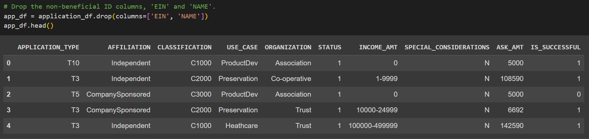
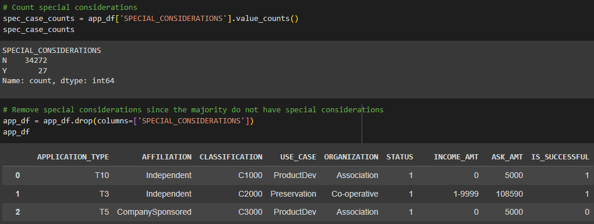
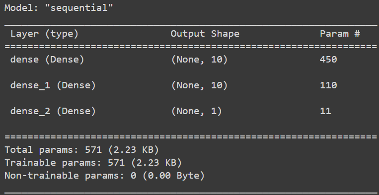
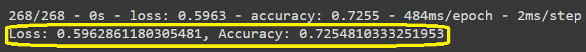

# deep-learning-challenge
Module 21 challenge

## Overview
The purpose of this analysis was to create a model that would help Alphabet Soup select/predict potential successful applicants. Using a dataset with more than 34,000 companies that Alphabet Soup has previously funded, I implemented machine learning and neural network techniques to create a model that aimed to achieve at least 75% accuracy in selecting successful ventures.

-----------------------------------

## Results

### Data Preprocessing
* Model Target (Dependent Variable): the column "IS_SUCCESSFUL" was chosen as my target, since a successful company was the ultimate goal of each applicant. Each applicant's success was marked with a 0 or a 1.
* Model Features (Independent Variables): after preprocessing the data, the chosen features were APPLICATION_TYPE, AFFILIATION, CLASSIFICATION, USE_CASE, ORGANIZATION, STATUS, INCOME_AMT, SPECIAL_CONSIDERATIONS, and ASK_AMT for the original model (before optimization). In the optimization portion, I kept all features except SPECIAL_CONSIDERATIONS. Figure 1 shows the original preprocessed data.
  

  
  Fig 1, original preprocessed data

* Removed Variables (no impact on features or target): in the original model, only the EIN and NAME columns were dropped. In the optimization file I also dropped SPECIAL_CONSIDERATIONS. I chose to remove that feature due to the majority of the values being N and a very small percentage being special considerations (~0.08%), and I did not think that this would have much, if any, impact on the target. See figure 2 for the optimized preprocessed data.

  
  Fig 2, optimized preprocessed data without SPECIAL_CONSIDERATIONS

### Compiling, Training, and Evaluating the Model
#### How many neurons, layers, and activation functions did you select for your neural network model, and why?
#### Original Model:
* I started with 2 hidden layers and 3 nodes in each hidden layer. The loss was significant at around 8, and the accuracy was around 0.42. I used 100 epochs in this iteration
* Using Xpert Learning Assistant to help determine the number of nodes (it recommended using a number between the number of inputs and outputs), I chose 10 to see how the loss and accuracy were affected. I chose to keep the activation for each layer and the output layer to be relu since it is usually the default. This resulted in with a loss of 0.597 and an accuracy of 0.725. Figures 3 and 4 show the original layers, nodes, output, and evaluation scores.

  
  Figs 3 and 4, original model layers and evaluation

#### What steps did you take in your attempts to increase model performance?
#### Optimization Attempt # 1:
* I chose to keep 2 hidden layers and 10 nodes in each layer. The hidden layers still used a relu activation, but I changed the output layer to a sigmoid since the output range was either 0 or 1. The only other change I made was increasing the number of epochs to 150.
* This attempt yielded a loss of 0.553 and an accuracy of 0.726, which is slightly better than the original model.
#### Optimization Attempt # 2:
* This attempt I still kept 2 hidden layers and 10 nodes in the first layer, but I decreased to 8 nodes in the second layer. I chose to keep the activations the same in each layer as attempt # 1, as well as 150 epochs.
* I decided to keep the model similar since the original model and attempt # 1 both had an accuracy of just under 0.750, and I did not want to change too many things that may have affected the accuracy drastically.
* This attempt yielded a loss of 0.554 and an accuracy of 0.726, nearly exactly the same as attempt # 1. 
#### Optimization Attempt # 3:
* My final attempt at optimization was to employ the auto-optimizer kerastuner. Using module 21-2 activities 04 and 05 as guidelines, I set the tuner to create a sequential model with hyperparameter options. I allowed kerastuner to choose between relu, tanh, and sigmoid activations; between 1 and 41 neurons in the first layer (41 being the limit because there is a total of 41 columns in the dataframe used); 1 to 5 hidden layers with 1 to 15 neurons each; and lastly I set the output activation as sigmoid.

**Were you able to achieve the target model performance?**

-----------------------------------
## Summary: Summarize the overall results of the deep learning model. Include a recommendation for how a different model could solve this classification problem, and then explain your recommendation.
Overall, the closest that I was able to get to 0.750 accuracy was -.
